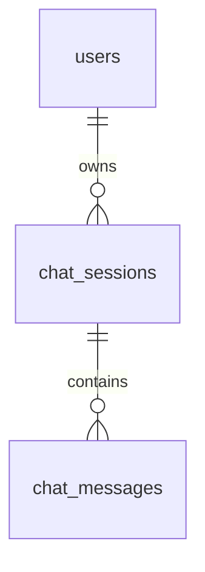

# Database Schema - DrKaset

Database engine: MySQL. ORM: SQLAlchemy.
Source files: `backend/db/models.py`, `db/init.sql`, and `db/migrations`.

## Tables

### `users`

| Column | Type | Key | Notes |
| --- | --- | --- | --- |
| `id` | int | PK, auto increment | User ID |
| `email` | varchar(255) | Unique, indexed | Login email |
| `hashed_password` | varchar(255) |  | bcrypt hashed password |
| `is_active` | tinyint/bool |  | Active flag, default true |
| `created_at` | datetime |  | Created timestamp |

### `chat_sessions`

| Column | Type | Key | Notes |
| --- | --- | --- | --- |
| `id` | int | PK, auto increment | Session ID |
| `user_id` | int | FK -> `users.id`, indexed | Session owner |
| `title` | varchar(255) |  | Session title |
| `created_at` | datetime |  | Created timestamp |
| `updated_at` | datetime |  | Updated timestamp |

### `chat_messages`

| Column | Type | Key | Notes |
| --- | --- | --- | --- |
| `id` | int | PK, auto increment | Message ID |
| `session_id` | int | FK -> `chat_sessions.id`, indexed | Parent session |
| `role` | enum(`user`,`assistant`) |  | Message speaker |
| `content` | text |  | Message text |
| `intent` | varchar(50) |  | Intent classification |
| `created_at` | datetime |  | Created timestamp |

## Relationships



## Setup SQL

```bash
mysql -u root -p < db/init.sql
```

The backend also calls `Base.metadata.create_all(bind=engine)` during startup, so missing tables are created automatically when the database exists and credentials are valid.
