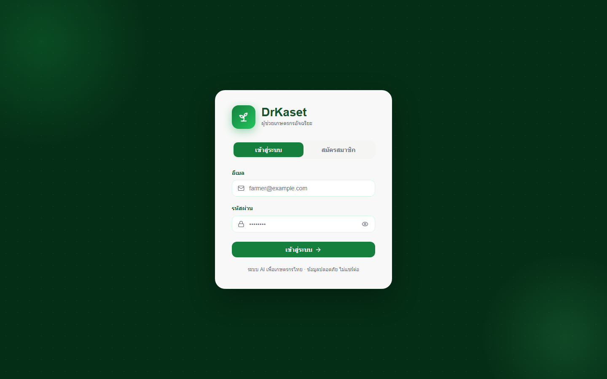
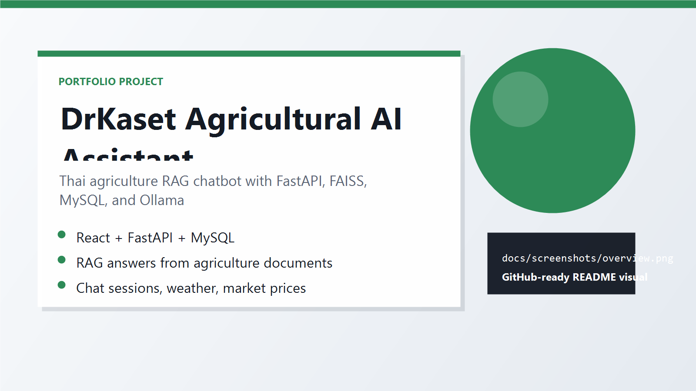

# DrKaset Agricultural AI Assistant

DrKaset is a full-stack agricultural assistant designed to help Thai farmers access agricultural information through a conversational interface.

The system combines a React frontend, FastAPI backend, MySQL database, FAISS vector search, and Ollama-powered RAG to provide answers based on prepared agricultural reference documents.

## Screenshots

<p align="center">
  
  <br>
  
</p>

## Features

- User registration and authentication
- Protected chat history
- AI-powered agricultural question answering
- RAG-based information retrieval from agricultural documents
- Streaming chat responses
- Chat sessions and message history
- Weather information
- Agricultural market price information
- Data preparation and document indexing pipeline

## Tech Stack

| Layer | Technology |
| --- | --- |
| Frontend | React 18, Vite, Axios, React Router, React Markdown |
| Backend | FastAPI, Python, SQLAlchemy |
| AI / RAG | Ollama, LangChain, Sentence Transformers, FAISS |
| Database | MySQL |

## My Contribution

### Web Application Development

Worked as part of the development team with a focus on the web application.

- Developed and worked with the React-based frontend
- Integrated frontend functionality with backend APIs
- Worked with application flow and user interface
- Participated in testing and system integration

## Project Structure

```text
CSI_AI_DrKaset/
├── backend/
│   ├── main.py
│   ├── config.py
│   ├── database.py
│   ├── api/
│   ├── auth/
│   ├── db/
│   ├── rag/
│   └── schemas/
├── frontend/
│   └── src/
├── data_preparation/
└── db/
    ├── init.sql
    └── migrations/
